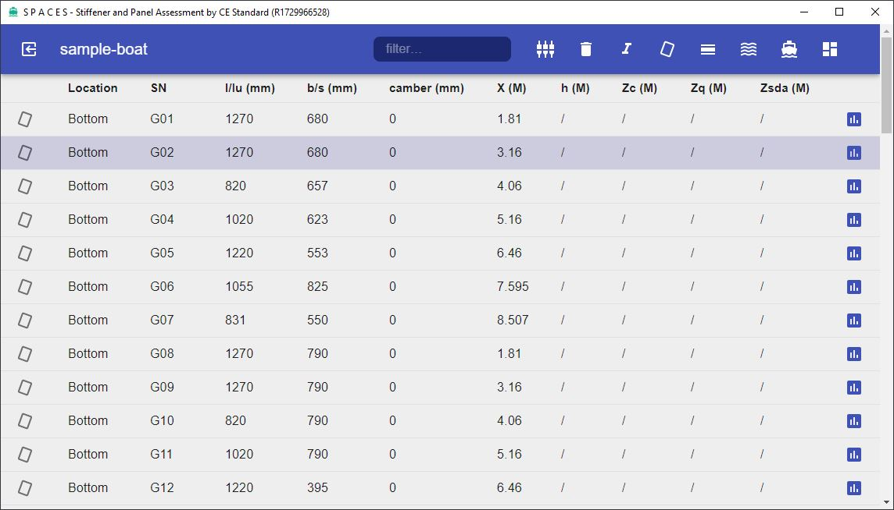

`SPACES` 是一个基于`Electron`框架的桌面应用，可评估复合材料小艇的结构单元是否满足CE规范中的相关要求。

#### 适用

小艇采用玻璃钢等复合材料进行制造且适用CE（ISO-12215-5）相关规范；程序采用`简单方式`核算局部结构单元，制作铺层的复合材料在船长、船宽两个方向的性能一致。

#### 安装

应用采用压缩包的形式发行，[下载](https://github.com/microvdev/spaces/releases) 最新版本对应的压缩包并解压，将解压目录移动到安装目录下存放即可。双击目录下`spaces.exe`启动应用，也可以创建`spaces.exe`的快捷方式便捷启动。

应用会在用户目录下生成`.microvdev`目录用于存放计算过程中产生的数据，`Electron`框架会在用户目录`AppData\Roaming`目录下生成`spaces`目录缓存框架数据。

应用为绿色软体，不会写入注册表或注册Windows服务，退出应用后删除应用及缓存文件夹即可完成卸载。

#### 使用

##### 项目

在进入项目前应用会弹出选择页面，在页面中可以进行新建、删除等操作，点击页面中列出的项目图标进入该项目主页面，在项目主页面中点击`主要参数`按钮弹出对话框，可以再次编辑项目主要参数。

项目各数据存在依赖性（材料 <= 铺层 <= 结构单元），被依赖引用的数据不能删除。

##### 材料

点击主界面工具栏`材料`按钮进入材料页面，在此可以进行材料的新建、删除、导入、导出等操作。材料是组成复合材料的各层，主要分为G、C、A三类，即复材纤维层、芯材、胶；应用会为新建项目加入样本数据，铺层编辑需要引用使用的材料。

##### 铺层

铺层是对复材按先后顺序施工信息的描述，根据有无芯材可以分为单层板`（SSP）`、夹芯材`（SWP）`，铺层信息被板格和结构件（帽形材）引用，生成结构单元前确认使用的铺层已准备就绪。在铺层页面可以进行新建、编辑、删除、导入、导出等操作。

##### 结构单元

结构单元分为板格、帽形材两种，其中板格还根据是否使用芯材分为单板、夹芯材，对应不同合规要求。项目主页面中用列表形式显示已经定义的结构单元，每行对应一个结构单元，包含结构单元的类型、位置、编号、长、宽、坐标、合规等信息。

点击工具栏相应按钮可以生成新的结构单元，此时新建行右侧的合规按钮为红色，表示该结构单元未通过合规检验。为新建单元输入必要参数，点击合规按钮即可进入评估页面。

为结构单元选择适当的铺层（对于帽形材还需要输入结构剖面尺寸、选择带板及粘合材料），点击评估按钮后应用会评估并显示结果是否满足各项合规要求，若通过合规评估则主页面中该结构单元的合规按钮会显示为蓝色。

##### 生成报告

各结构单元通过评估后，点击工具栏上`统计`按钮弹出统计信息对话框，点击`REPORT`按钮，应用会生成Excel格式的报告并保存到文件，其中包含有项目主要参数、材料、铺层、板格、结构件的相关数据备查。
